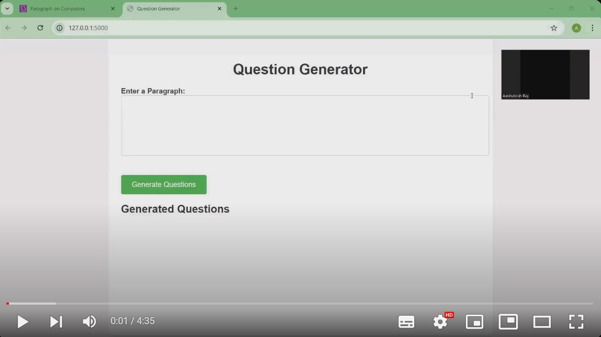

# Question Generation Flask Application

This project is a Flask-based web application that generates multiple-choice questions from a given paragraph of content. The application uses machine learning models to extract keywords, generate questions, and create distractors to form a quiz. The generated questions, options, and answers are displayed on a web interface.
The primary use case is for educators and trainers who want to automate quiz generation based on reading materials, making it easier and faster to create assessments.

## Features
- Takes a paragraph of content as input.
- Automatically generates multiple-choice questions.
- Provides distractors (incorrect options) that are contextually relevant.
- Displays the generated questions, answers, and options on the web page.

## How It Works
The project is divided into several stages:

1. **Input**: 
    - The user provides a paragraph of text via the web interface.
   
2. **Summarization**:
    - The input can be summarized using a pre-trained summarizer model (like T5) to reduce the content and focus on key points.
   
3. **Keyword Extraction**:
    - Keywords from the input text are extracted using a keyword extraction algorithm (like spaCy) to identify important nouns or phrases.

4. **Question Generation**:
    - Using a T5-based question generation model, the keywords and context are used to form grammatically correct questions.

5. **Distractor Generation**:
    - Distractors (incorrect answers) are generated using the **Sense2Vec** model, which provides semantically related but incorrect options.
    - **WordNet** is used to ensure that the distractors are not too similar or repetitive.
    
6. **Display**:
    - The generated questions, options, and correct answers are returned to the frontend and displayed on the web page.

## Tools and Libraries Used
- **Flask**: A lightweight web framework to handle requests and responses.
- **T5 Model**: For question generation.
- **Sense2Vec**: Used to generate distractors that are semantically related to the correct answer.
- **WordNet (NLTK)**: Ensures the generated distractors are distinct and appropriate.
- **spaCy**: For NLP tasks such as keyword extraction.
- **jQuery & HTML/CSS**: Frontend implementation to interact with the backend Flask API.

## Web Interface
The web interface is built using HTML, CSS, and jQuery. The user provides a paragraph of text and clicks a button to generate questions. A loading message is shown while the trained model processes the input, which takes approximately 4-5 minutes.

## Demonstration Video
You can watch the complete demonstration of the project in the following video:

## Future Improvements
Here are some potential future enhancements to the project:
- **Improving Question Complexity**: Allowing for more complex, multi-part questions or open-ended questions.
- **Question Validation**: Incorporating a feedback system where users can rate the quality of the generated questions and distractors.
- **Faster Processing**: Optimizing model inference time to reduce the 4-5 minute wait period.
- **Supporting Additional Languages**: Extending the application to support multiple languages for international users.

